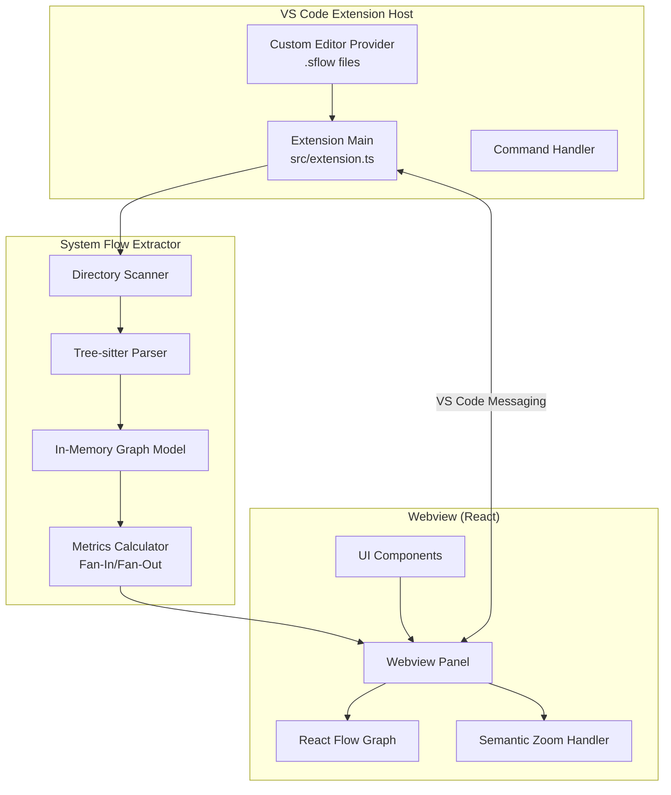

# Design Document: SentinelFlow

## Overview

SentinelFlow is a VS Code extension that provides system flow visualization and architectural insight. The extension is an advisor-only tool that explains architectural risk without modifying code. Phase 1 implements the System Flow Extractor with three main components:

1. **Extension Host** (Main Process): Orchestrates operations, manages UI integration, and handles VS Code API interactions
2. **System Flow Extractor**: Scans directories, parses files with Tree-sitter, extracts symbols and relationships, and builds in-memory graph models
3. **Webview** (Renderer Process): Provides interactive React-based visualization using React Flow

The extension uses Tree-sitter for language-agnostic parsing and maintains all data in memory for Phase 1.

## Architecture

### High-Level Component Diagram



### Process Communication

The extension uses message-passing for inter-process communication:

- **Extension Host ↔ Webview**: VS Code Webview API with postMessage

### Data Flow

1. **Scanning Flow**: File System → Directory Scanner → Tree-sitter Parser → In-Memory Graph
2. **Visualization Flow**: Extension Host (request) → In-Memory Graph → Webview (render)
3. **Navigation Flow**: Webview (node click) → Extension Host → VS Code Editor API

## Components and Interfaces

### 1. Extension Host (src/extension.ts)

**Responsibilities:**
- Extension lifecycle management (activate/deactivate)
- Command registration and handling
- Custom editor provider registration for .sflow files
- Webview panel management
- Configuration management
- Coordination with System Flow Extractor

**Key Interfaces:**

```typescript
interface ExtensionContext {
  subscriptions: Disposable[];
  workspaceState: Memento;
  globalState: Memento;
  extensionPath: string;
}

interface WebviewMessage {
  type: 'requestGraph' | 'selectNode' | 'openFile' | 'applyFilter';
  payload: any;
}

interface WebviewResponse {
  type: 'graphData' | 'nodeDetails' | 'error';
  payload: any;
}
```

**Commands:**
- `sentinelflow.openGraph`: Open visualization webview
- `sentinelflow.rescan`: Re-scan workspace and rebuild graph
- `sentinelflow.exportDiagnostics`: Export diagnostic logs

### 2. System Flow Extractor

**Responsibilities:**
- File system scanning
- Tree-sitter parsing orchestration
- Symbol extraction and relationship mapping
- In-memory graph construction
- Fan-In and Fan-Out calculation

**Key Interfaces:**

```typescript
interface ScanRequest {
  workspacePath: string;
  filePatterns: string[];
  excludePatterns: string[];
}

interface ParsedSymbol {
  id: string;
  name: string;
  type: 'function' | 'class' | 'variable' | 'interface' | 'type';
  filePath: string;
  startLine: number;
  endLine: number;
}

interface SymbolRelationship {
  fromSymbolId: string;
  toSymbolId: string;
  type: 'calls' | 'imports' | 'references';
}

interface GraphModel {
  symbols: Map<string, ParsedSymbol>;
  relationships: SymbolRelationship[];
  fanIn: Map<string, number>;
  fanOut: Map<string, number>;
}
```

**Algorithm: Directory Scanning**

```
function scanWorkspace(workspacePath: string, excludePatterns: string[]): string[]:
  files = []
  
  function scanDirectory(dirPath: string):
    entries = readDirectory(dirPath)
    
    for each entry in entries:
      if entry.isDirectory():
        if not matchesExcludePattern(entry.path, excludePatterns):
          scanDirectory(entry.path)
      else if entry.isFile():
        if isSupportedFileType(entry.path):
          files.push(entry.path)
  
  scanDirectory(workspacePath)
  return files
```

**Algorithm: Symbol Extraction**

```
function extractSymbols(filePath: string): ParsedSymbol[]:
  sourceCode = readFile(filePath)
  ast = treeSitter.parse(sourceCode)
  symbols = []
  
  function traverse(node: ASTNode):
    if node.type in ['function_declaration', 'class_declaration', 'variable_declaration']:
      symbol = {
        id: generateId(filePath, node.name),
        name: node.name,
        type: mapNodeTypeToSymbolType(node.type),
        filePath: filePath,
        startLine: node.startPosition.row,
        endLine: node.endPosition.row
      }
      symbols.push(symbol)
    
    for each child in node.children:
      traverse(child)
  
  traverse(ast.rootNode)
  return symbols
```

**Algorithm: Relationship Detection**

```
function extractRelationships(filePath: string, ast: ASTNode, symbols: ParsedSymbol[]): SymbolRelationship[]:
  relationships = []
  
  function traverse(node: ASTNode, currentSymbol: ParsedSymbol):
    if node.type == 'call_expression':
      calledSymbol = resolveSymbol(node.functionName, symbols)
      if calledSymbol:
        relationships.push({
          fromSymbolId: currentSymbol.id,
          toSymbolId: calledSymbol.id,
          type: 'calls'
        })
    
    if node.type == 'import_statement':
      importedFile = resolveImport(node.importPath, filePath)
      relationships.push({
        fromSymbolId: currentSymbol.id,
        toSymbolId: importedFile,
        type: 'imports'
      })
    
    for each child in node.children:
      traverse(child, currentSymbol)
  
  for each symbol in symbols:
    symbolNode = findNodeForSymbol(ast, symbol)
    traverse(symbolNode, symbol)
  
  return relationships
```

**Algorithm: Fan-In and Fan-Out Calculation**

```
function calculateMetrics(graph: GraphModel):
  fanIn = new Map()
  fanOut = new Map()
  
  // Initialize all symbols with 0
  for each symbol in graph.symbols:
    fanIn.set(symbol.id, 0)
    fanOut.set(symbol.id, 0)
  
  // Count relationships
  for each relationship in graph.relationships:
    fanOut.set(relationship.fromSymbolId, fanOut.get(relationship.fromSymbolId) + 1)
    fanIn.set(relationship.toSymbolId, fanIn.get(relationship.toSymbolId) + 1)
  
  graph.fanIn = fanIn
  graph.fanOut = fanOut
```

### 3. Visualization Pipeline

**Responsibilities:**
- Transform graph data for React Flow
- Handle user interactions (zoom, pan, selection)
- Implement semantic zoom via hierarchical aggregation
- Apply coupling heat indicators
- Render different visualization modes

**Key Interfaces:**

```typescript
interface GraphNode {
  id: string;
  type: 'file' | 'symbol';
  data: {
    label: string;
    fanIn?: number;
    fanOut?: number;
    couplingHeat?: number;
  };
  position: { x: number; y: number };
}

interface GraphEdge {
  id: string;
  source: string;
  target: string;
  type: 'calls' | 'imports' | 'references';
  animated?: boolean;
}

interface ZoomLevel {
  level: number; // 0 = file-level, 1 = symbol-level
  aggregated: boolean;
}
```

**Algorithm: Graph Transformation for React Flow**

```
function transformToReactFlow(graph: GraphModel): { nodes: GraphNode[], edges: GraphEdge[] }:
  nodes = []
  edges = []
  
  // Create nodes for each symbol
  for each symbol in graph.symbols.values():
    couplingHeat = calculateCouplingHeat(
      graph.fanIn.get(symbol.id),
      graph.fanOut.get(symbol.id)
    )
    
    nodes.push({
      id: symbol.id,
      type: 'symbol',
      data: {
        label: symbol.name,
        fanIn: graph.fanIn.get(symbol.id),
        fanOut: graph.fanOut.get(symbol.id),
        couplingHeat: couplingHeat
      },
      position: { x: 0, y: 0 } // Layout will be computed by React Flow
    })
  
  // Create edges for each relationship
  for each relationship in graph.relationships:
    edges.push({
      id: `${relationship.fromSymbolId}-${relationship.toSymbolId}`,
      source: relationship.fromSymbolId,
      target: relationship.toSymbolId,
      type: relationship.type
    })
  
  return { nodes, edges }
```

**Algorithm: Coupling Heat Calculation**

```
function calculateCouplingHeat(fanIn: number, fanOut: number): number:
  totalCoupling = fanIn + fanOut
  
  // Normalize to 0-100 scale
  // Thresholds: 0-5 = low, 6-15 = medium, 16+ = high
  if totalCoupling <= 5:
    return totalCoupling * 10  // 0-50
  else if totalCoupling <= 15:
    return 50 + (totalCoupling - 5) * 3  // 50-80
  else:
    return min(100, 80 + (totalCoupling - 15) * 2)  // 80-100
```

**Algorithm: Semantic Zoom via Hierarchical Aggregation**

```
function applySemanticZoom(graph: GraphModel, zoomLevel: number): { nodes: GraphNode[], edges: GraphEdge[] }:
  if zoomLevel >= 1:
    // Symbol-level view (fully expanded)
    return transformToReactFlow(graph)
  else:
    // File-level view (aggregated)
    return aggregateToFileLevel(graph)

function aggregateToFileLevel(graph: GraphModel): { nodes: GraphNode[], edges: GraphEdge[] }:
  fileNodes = new Map()
  fileEdges = new Map()
  
  // Group symbols by file
  for each symbol in graph.symbols.values():
    if not fileNodes.has(symbol.filePath):
      fileNodes.set(symbol.filePath, {
        id: symbol.filePath,
        type: 'file',
        data: {
          label: getFileName(symbol.filePath),
          fanIn: 0,
          fanOut: 0
        },
        position: { x: 0, y: 0 }
      })
    
    // Aggregate metrics
    fileNode = fileNodes.get(symbol.filePath)
    fileNode.data.fanIn += graph.fanIn.get(symbol.id)
    fileNode.data.fanOut += graph.fanOut.get(symbol.id)
  
  // Aggregate relationships to file-level
  for each relationship in graph.relationships:
    fromFile = graph.symbols.get(relationship.fromSymbolId).filePath
    toFile = graph.symbols.get(relationship.toSymbolId).filePath
    
    if fromFile != toFile:
      edgeKey = `${fromFile}-${toFile}`
      if not fileEdges.has(edgeKey):
        fileEdges.set(edgeKey, {
          id: edgeKey,
          source: fromFile,
          target: toFile,
          type: 'aggregated'
        })
  
  return {
    nodes: Array.from(fileNodes.values()),
    edges: Array.from(fileEdges.values())
  }
```

### 4. Custom Editor Provider for .sflow Files

**Responsibilities:**
- Register custom editor for .sflow file extension
- Serialize and deserialize graph state
- Provide save and load functionality

**Implementation:**

```typescript
class SFlowEditorProvider implements CustomTextEditorProvider {
  async resolveCustomTextEditor(
    document: TextDocument,
    webviewPanel: WebviewPanel
  ): Promise<void> {
    // Load graph state from .sflow file
    const graphState = JSON.parse(document.getText());
    
    // Send graph state to webview
    webviewPanel.webview.postMessage({
      type: 'loadGraph',
      payload: graphState
    });
    
    // Handle save requests from webview
    webviewPanel.webview.onDidReceiveMessage(message => {
      if (message.type === 'saveGraph') {
        const edit = new WorkspaceEdit();
        edit.replace(
          document.uri,
          new Range(0, 0, document.lineCount, 0),
          JSON.stringify(message.payload, null, 2)
        );
        workspace.applyEdit(edit);
      }
    });
  }
}
```

## Data Models

### Core Entities

**Symbol:**
- Represents a code entity (function, class, variable, etc.)
- Contains location information (file path, line numbers)
- Primary unit of analysis

**Relationship:**
- Represents a connection between symbols
- Types: calls, imports, references
- Stored as edges in the graph

**Graph Model:**
- In-memory data structure containing all symbols and relationships
- Includes computed metrics (Fan-In, Fan-Out)
- Source of truth for visualization

### State Management

**Extension State:**
- Active webview panels
- Configuration cache
- Current graph model

**Webview State (React):**
- Graph data (nodes, edges)
- Zoom level
- Selected nodes
- Filter state

## Correctness Properties

A property is a characteristic or behavior that should hold true across all valid executions of a system.

### Property 1: Complete Workspace Scanning

*For any* workspace containing supported file types, when scanning is initiated, all supported files in the workspace should be discovered by the System_Flow_Extractor.

**Validates: Requirements 1.1**

### Property 2: Symbol Extraction Completeness

*For any* valid source file, when parsed by Tree_Sitter, the extracted symbols should include all functions, classes, variables, and interfaces defined in that file.

**Validates: Requirements 2.1**

### Property 3: Relationship Detection Accuracy

*For any* function call in a source file, the System_Flow_Extractor should create a corresponding relationship in the graph model.

**Validates: Requirements 3.1**

### Property 4: Fan-In Calculation Correctness

*For any* symbol, the calculated Fan_In value should equal the number of relationships where that symbol is the target.

**Validates: Requirements 4.1**

### Property 5: Fan-Out Calculation Correctness

*For any* symbol, the calculated Fan_Out value should equal the number of relationships where that symbol is the source.

**Validates: Requirements 4.2**

### Property 6: Graph Node Completeness

*For any* extracted symbol, there should be a corresponding node in the visualization graph.

**Validates: Requirements 5.1**

### Property 7: Node Selection State

*For any* node in the graph, when clicked, the node should transition to a selected state and its details should be retrievable.

**Validates: Requirements 5.2, 10.1**

### Property 8: File-Level Aggregation Correctness

*For any* set of symbols in the same file, when aggregated to file-level view, the file node's Fan_In should equal the sum of all symbol Fan_In values in that file.

**Validates: Requirements 6.1**

### Property 9: Coupling Heat Monotonicity

*For any* two symbols A and B, if (fanIn_A + fanOut_A) > (fanIn_B + fanOut_B), then couplingHeat_A >= couplingHeat_B.

**Validates: Requirements 7.1**

### Property 10: Search Filtering Correctness

*For any* search query and graph state, all visible nodes after filtering should match the query by name, and all matching nodes should be visible.

**Validates: Requirements 9.1**

### Property 11: Directory Scope Filtering

*For any* selected directory filter, all visible nodes should have file paths within the selected directory scope, and all nodes outside the scope should be hidden.

**Validates: Requirements 9.3**

### Property 12: Parse Error Isolation

*For any* workspace where some files fail to parse, the System_Flow_Extractor should successfully extract symbols from all parseable files and log errors for failed files without stopping the scanning process.

**Validates: Requirements 12.2**

## Error Handling

### Extension Host Error Handling

**Webview Communication Failures:**
- Implement message acknowledgment protocol
- Retry failed messages up to 3 times
- Detect webview disconnection and offer reload
- Preserve webview state for recovery

### System Flow Extractor Error Handling

**Parsing Failures:**
- Catch Tree-sitter parsing exceptions per file
- Log parsing errors with file path and error details
- Continue scanning remaining files
- Provide diagnostic information for unsupported syntax

**File System Errors:**
- Handle permission denied errors gracefully
- Skip inaccessible directories and continue scanning
- Log file system errors with context

### Webview Error Handling

**Rendering Failures:**
- Catch React rendering errors with Error Boundaries
- Display fallback UI for failed components
- Log rendering errors to Extension Host
- Provide "Reset View" action to recover

**Graph Layout Failures:**
- Detect layout algorithm failures or timeouts
- Fall back to simpler layout algorithm
- Limit graph size for complex layouts (max 1000 nodes)
- Provide progressive rendering for large graphs

**User Input Validation:**
- Validate search queries before processing
- Sanitize filter inputs
- Provide immediate feedback for invalid inputs
- Gracefully handle empty or malformed queries

## Testing Strategy

### Dual Testing Approach

SentinelFlow requires both unit testing and property-based testing for comprehensive coverage:

**Unit Tests:**
- Specific examples demonstrating correct behavior
- Edge cases (empty workspaces, single-file projects, deeply nested structures)
- Error conditions (parsing failures, file system errors)
- Integration points between components (Extension Host ↔ Webview)
- UI interactions (node selection, filter application)

**Property-Based Tests:**
- Universal properties that hold for all inputs
- Comprehensive input coverage through randomization
- Minimum 100 iterations per property test
- Each test tagged with: **Feature: sentinelflow, Property {N}: {property text}**

### Property-Based Testing Configuration

**Framework Selection:**
- TypeScript: Use `fast-check` library for property-based testing
- Minimum 100 iterations per property test (configurable via `fc.assert` options)

**Test Organization:**
- Group property tests by component (System Flow Extractor, Visualization, etc.)
- Each property test must reference its design document property number
- Use descriptive test names matching property titles

**Example Property Test Structure:**

```typescript
import fc from 'fast-check';

describe('System Flow Extractor Properties', () => {
  // Feature: sentinelflow, Property 4: Fan-In Calculation Correctness
  it('Property 4: Fan-In equals number of incoming relationships', () => {
    fc.assert(
      fc.property(
        fc.array(symbolArbitrary),
        fc.array(relationshipArbitrary),
        (symbols, relationships) => {
          const graph = buildGraph(symbols, relationships);
          calculateMetrics(graph);
          
          for (const symbol of symbols) {
            const expectedFanIn = relationships.filter(
              r => r.toSymbolId === symbol.id
            ).length;
            
            expect(graph.fanIn.get(symbol.id)).toBe(expectedFanIn);
          }
        }
      ),
      { numRuns: 100 }
    );
  });
});
```

### Unit Testing Strategy

**Component-Level Tests:**
- Extension Host: Command handling, configuration management
- System Flow Extractor: Scanning, parsing, symbol extraction, relationship detection, metric calculation
- Visualization Pipeline: Graph transformation, semantic zoom, filtering
- Custom Editor Provider: .sflow file save and load

**Integration Tests:**
- End-to-end scanning flow (scan → parse → extract → build graph)
- Webview rendering with real graph data
- Node selection and navigation

**Edge Case Tests:**
- Empty workspace (no files)
- Single file workspace
- Deeply nested directory structures
- Files with parsing errors
- Circular dependencies
- High coupling symbols (Fan_In > 50)

### Test Data Generation

**Arbitrary Generators for Property Tests:**

```typescript
// Symbol generator
const symbolArbitrary = fc.record({
  id: fc.uuid(),
  name: fc.string({ minLength: 1, maxLength: 50 }),
  type: fc.constantFrom('function', 'class', 'variable', 'interface', 'type'),
  filePath: fc.string({ minLength: 1, maxLength: 100 }),
  startLine: fc.integer({ min: 1, max: 1000 }),
  endLine: fc.integer({ min: 1, max: 1000 }),
});

// Relationship generator
const relationshipArbitrary = fc.record({
  fromSymbolId: fc.uuid(),
  toSymbolId: fc.uuid(),
  type: fc.constantFrom('calls', 'imports', 'references'),
});

// Graph node generator
const graphNodeArbitrary = fc.record({
  id: fc.uuid(),
  type: fc.constantFrom('file', 'symbol'),
  data: fc.record({
    label: fc.string({ minLength: 1, maxLength: 100 }),
    fanIn: fc.option(fc.integer({ min: 0, max: 100 })),
    fanOut: fc.option(fc.integer({ min: 0, max: 100 })),
  }),
  position: fc.record({
    x: fc.float({ min: 0, max: 5000 }),
    y: fc.float({ min: 0, max: 5000 }),
  }),
});
```

### Performance Testing

**Benchmarks:**
- Scanning speed: Files per second for various project sizes
- Graph rendering: Time to render graphs of various sizes
- Memory usage: Peak memory during scanning and visualization

**Performance Targets:**
- Scan 1000 files in under 30 seconds
- Graph rendering (500 nodes) completes in under 2 seconds
- Memory usage stays reasonable for typical projects

### Continuous Integration

**CI Pipeline:**
1. Lint and type check (TypeScript)
2. Run unit tests with coverage (target: 80%+)
3. Run property-based tests (100 iterations each)
4. Run integration tests
5. Build extension package
6. Run smoke tests on packaged extension

**Test Environment:**
- Node.js version matching VS Code's Electron
- Sample workspaces of various sizes
